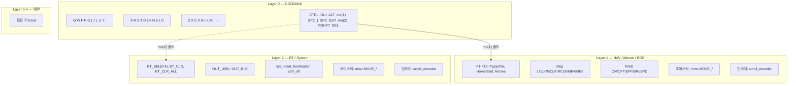

# Eyelash Sofle — ZMK Firmware Configuration

Eyelash Sofle 분리형 키보드(nRF52840)의 ZMK 펌웨어 설정 저장소.
GitHub Actions CI가 push 시 `.uf2` 펌웨어를 자동 빌드하고, keymap-drawer가 키맵 SVG를 자동 생성한다.

- 원본 보드 모듈: [a741725193/zmk-sofle](https://github.com/a741725193/zmk-sofle)
- ZMK 버전: v0.3.0

## 브랜치 전략

| 브랜치 | 역할 |
|---|---|
| `feat/qwerty` | 표준 QWERTY 배열 및 기본 엄지 최적화 베이스라인 |
| `feat/colemak` | Colemak 배열 실험. 쿼티의 엄지 UX 로직을 이식하여 관리 |
| `feat/workman` | Workman 배열 실험 |

**공통 규칙**: 모든 브랜치는 공통 비헤이비어(Behaviors)와 엄지 최적화 설정을 공유하며, ZMK Studio 수정 사항은 반드시 `.keymap` 소스 코드로 역포팅한다.

## Colemak 베이스 레이어 매핑

QWERTY 대비 17키가 재배치된다. 숫자 행, 엄지 행, 조이스틱 열은 변경 없음.

| 물리 위치 | QWERTY | Colemak |
|---|---|---|
| 상단 3 | E | F |
| 상단 4 | R | P |
| 상단 5 | T | G |
| 상단 7 | Y | J |
| 상단 8 | U | L |
| 상단 9 | I | U |
| 상단 10 | O | Y |
| 상단 11 | P | ; |
| 홈 3 | S | R |
| 홈 4 | D | S |
| 홈 5 | F | T |
| 홈 6 | G | D |
| 홈 8 | J | N |
| 홈 9 | K | E |
| 홈 10 | L | I |
| 홈 11 | ; | O |
| 하단 7 | N | K |

## 레이어 구조

## 엄지 클러스터 모범 사례

배열(QWERTY/Colemak/Workman)이 바뀌어도 아래 설정은 **모든 브랜치에서 동일**하게 유지한다.

| 위치 | 동작 | 설명 |
|---|---|---|
| 왼쪽 엄지 내측 | `Mod-Tap (LShift / LANG1)` | 탭 = 한/영 전환, 홀드 = Shift |
| 왼쪽 엄지 중앙 | `Layer-Tap (layer1 / Space)` | 탭 = Space, 홀드 = NAV 레이어 |
| 오른쪽 롤러 클릭 | `Key Press (BSPC)` | 조이스틱 클릭 = Backspace, 새끼손가락 부담 경감 |
| 오른쪽 엄지 내측 | `Layer-Tap (layer2 / Enter)` | 탭 = Enter, 홀드 = BT/System 레이어 |

## 빌드

로컬 빌드 불필요. push 시 GitHub Actions가 자동 처리한다.

- `build.yml` — `.uf2` 펌웨어 컴파일 (eyelash_sofle_right, eyelash_sofle_left, settings_reset)
- `draw.yml` — 키맵 SVG 자동 생성 후 `[Draw]` 접두사로 자동 커밋

**플래싱**: GitHub Actions 아티팩트에서 `.uf2` 다운로드 → 키보드 부트로더 모드 진입 → 대용량 저장 장치에 복사.

## 키맵 시각화

## History

| 날짜 | 내용 |
|---|---|
| 2026-02-06 | 프로젝트 초기화 및 `feat/colemak` 브랜치에서 QWERTY → 표준 Colemak 배열 교체(17키 재배치). 엄지/조이스틱/인코더 설정 유지. |
| 2026-02-06 | 엄지 중심(Thumb-Centric) 모범 사례 설정 적용 및 ZMK Studio 역포팅 완료. |
| 2026-02-06 | CI 워크플로우(`build.yml`, `draw.yml`)에 `feat/*` 브랜치 자동 빌드 규칙 추가. |
